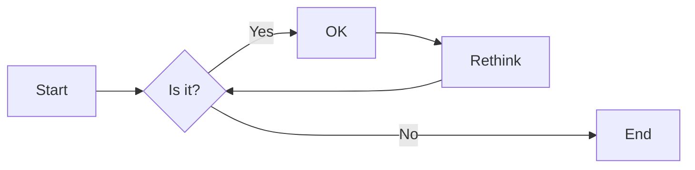
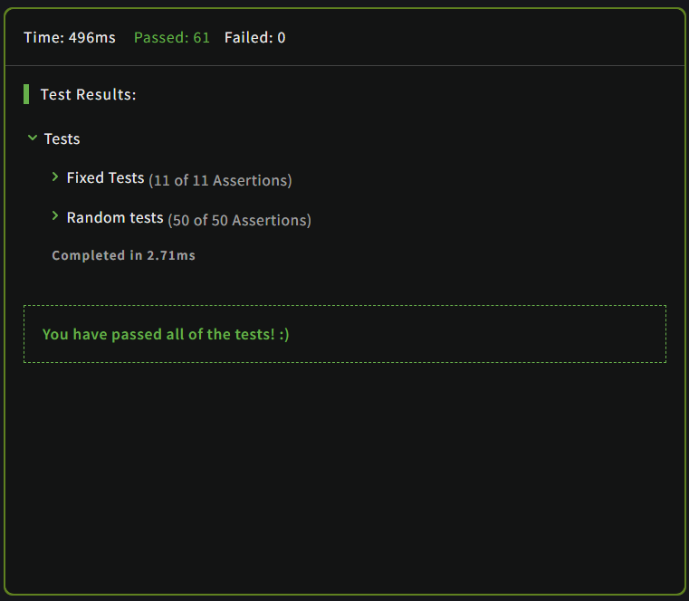
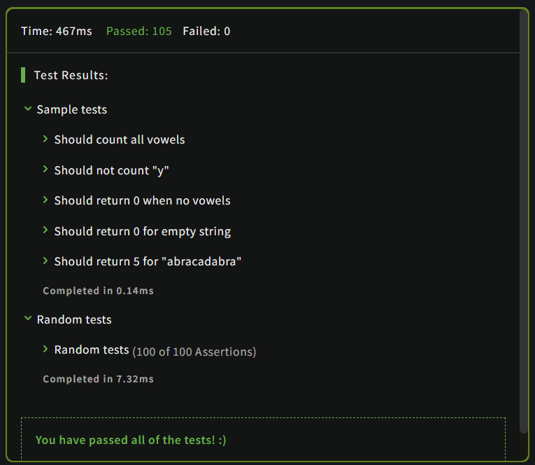
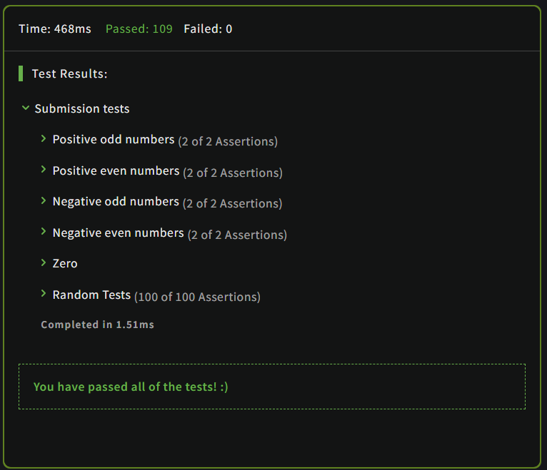
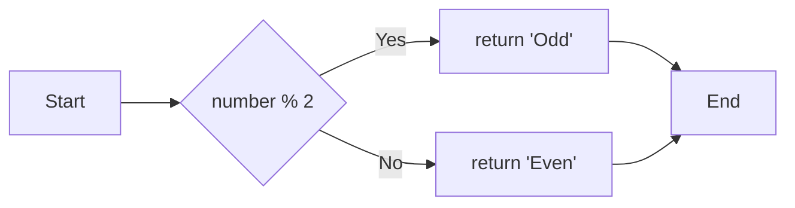

# 实验二 Python变量、简单数据类型

班级： 21计科2班

学号： 20210302222

姓名： 徐塬桀

Github地址：<https://github.com/Al0Hazz/python_course>

CodeWars地址：<https://www.codewars.com/users/Al0Hazz>

---

## 实验目的

1. 使用VSCode编写和运行Python程序
2. 学习Python变量和简单数据类型

## 实验环境

1. Git
2. Python 3.10
3. VSCode
4. VSCode插件

## 实验内容和步骤

### 第一部分

实验环境的安装

1. 安装Python，从Python官网下载Python 3.10安装包，下载后直接点击可以安装：[Python官网地址](https://www.python.org/downloads/)
2. 为了在VSCode集成环境下编写和运行Python程序，安装下列VScode插件
   - Python
   - Python Environment Manager
   - Python Indent
   - Python Extended
   - Python Docstring Generator
   - Jupyter
   - indent-rainbow
   - Jinja

---

### 第二部分

Python变量、简单数据类型和列表简介

完成教材《Python编程从入门到实践》下列章节的练习：

- 第2章 变量和简单数据类型

---

### 第三部分

在[Codewars网站](https://www.codewars.com)注册账号，完成下列Kata挑战：

---

#### 第1题：求离整数n最近的平方数（Find Nearest square number）

难度：8kyu

你的任务是找到一个正整数n的最近的平方数
例如，如果n=111，那么nearest_sq(n)（nearestSq(n)）等于121，因为111比100（10的平方）更接近121（11的平方）。
如果n已经是完全平方（例如n=144，n=81，等等），你需要直接返回n。
代码提交地址
<https://www.codewars.com/kata/5a805d8cafa10f8b930005ba>

---

#### 第2题：弹跳的球（Bouncing Balls）

难度：6kyu

一个孩子在一栋高楼的第N层玩球。这层楼离地面的高度h是已知的。他把球从窗口扔出去。球弹了起来,  例如:弹到其高度的三分之二（弹力为0.66）。他的母亲从离地面w米的窗户向外看,母亲会看到球在她的窗前经过多少次（包括球下落和反弹的时候）？

一个有效的实验必须满足三个条件：

- 参数 "h"（米）必须大于0
- 参数 "bounce "必须大于0且小于1
- 参数 “window "必须小于h。

如果以上三个条件都满足，返回一个正整数，否则返回-1。
**注意:只有当反弹球的高度严格大于窗口参数时，才能看到球。**
代码提交地址
<https://www.codewars.com/kata/5544c7a5cb454edb3c000047/train/python>

---

#### 第3题： 元音统计(Vowel Count)

难度： 7kyu

返回给定字符串中元音的数量（计数）。对于这个Kata，我们将考虑a、e、i、o、u作为元音（但不包括y）。输入的字符串将只由小写字母和/或空格组成。

代码提交地址：
<https://www.codewars.com/kata/54ff3102c1bad923760001f3>

---

#### 第4题：偶数或者奇数（Even or Odd）

难度：8kyu

创建一个函数接收一个整数作为参数，当整数为偶数时返回”Even”当整数位奇数时返回”Odd”。
代码提交地址：
<https://www.codewars.com/kata/53da3dbb4a5168369a0000fe>

### 第四部分

使用Mermaid绘制程序流程图

安装Mermaid的VSCode插件：

- Markdown Preview Mermaid Support
- Mermaid Markdown Syntax Highlighting

使用Markdown语法绘制你的程序绘制程序流程图（至少一个），Markdown代码如下：


显示效果如下：



查看Mermaid流程图语法-->[点击这里](https://mermaid.js.org/syntax/flowchart.html)

使用Markdown编辑器（例如VScode）编写本次实验的实验报告，包括[实验过程与结果](#实验过程与结果)、[实验考查](#实验考查)和[实验总结](#实验总结)，并将其导出为 **PDF格式** 来提交。

## 实验过程与结果

请将实验过程与结果放在这里，包括：

- [第二部分 Python变量、简单数据类型和列表简介](#第二部分)
- [第三部分 Codewars Kata挑战](#第三部分)
- 第一题
```
def nearest_sq(n):
    return round(n ** 0.5) ** 2
```


- 第二题
```
def bouncing_ball(h, bounce, window):
    if h <= 0 or bounce <= 0 or bounce >= 1 or window >= h:
        return -1
 
    count = 1
 
    while h * bounce > window:
        h *= bounce
        count += 2
 
    return count
  ```


- 第三题
```
def get_count(sentence):
    return sum(c in 'aeiou' for c in sentence)
```


- 第四题
```
def even_or_odd(number):
	return 'Odd' if number % 2 else 'Even'
```


- [第四部分 使用Mermaid绘制程序流程图](#第四部分)
- 第四题流程图如下：


注意代码需要使用markdown的代码块格式化，例如Git命令行语句应该使用下面的格式：


显示效果如下：

```bash
git init
git add .
git status
git commit -m "first commit"
```

如果是Python代码，应该使用下面代码块格式，例如：


显示效果如下：

```python
def add_binary(a,b):
    return bin(a+b)[2:]
```

代码运行结果的文本可以直接粘贴在这里。

**注意：不要使用截图，Markdown文档转换为Pdf格式后，截图可能会无法显示。**

## 实验考查

请使用自己的语言并使用尽量简短代码示例回答下面的问题，这些问题将在实验检查时用于提问和答辩以及实际的操作。

1. Python中的简单数据类型有那些？我们可以对这些数据类型做哪些操作？
```
Python中的简单数据类型包括数字（整数、浮点数、复数）、字符串、布尔值和None。对这些数据类型可以进行一些常见的操作，例如数学运算（加减乘除、取余等）、字符串拼接、比较、逻辑运算等。
```
2. 为什么说Python中的变量都是标签？
```
在Python中，变量实际上是对象的标签或引用。当我们将值赋给一个变量时，实际上是将变量与该值所在的内存地址关联起来。Python中的变量是动态类型的，这意味着变量可以引用任何类型的对象，而不需要事先声明变量的类型。
```
3. 有哪些方法可以提高Python代码的可读性？
```
以下是一些提高Python代码可读性的方法：
使用有意义的变量和函数命名，使其易于理解和记忆。
缩进和空格的一致性：使用统一的缩进和适当的空格来增加代码的可读性。
注释：在关键部分添加注释，解释代码的用途、实现细节或其他相关信息。
模块和函数的文档字符串：使用文档字符串来描述模块、类和函数的功能和用法。
拆分长行：将过长的代码行拆分为多行，使其易于阅读和理解。
避免使用过多的嵌套和复杂的表达式，使用辅助变量来提高代码的可读性。
按照PEP 8风格指南的建议编写代码，使其符合Python社区的共识和标准。
```

## 实验总结

总结一下这次实验你学习和使用到的知识，例如：编程工具的使用、数据结构、程序语言的语法、算法、编程技巧、编程思想。
```
在这次实验中，我学习和使用到了以下知识：

编程工具的使用：我使用了VSCode作为编程工具，通过它可以方便地编写和运行Python程序。

数据结构：我学习了Python中的变量和简单数据类型，例如整数、浮点数、字符串等。了解了它们的特点和基本操作。

程序语言的语法：我学习了Python的语法规则，例如变量的命名规则、注释的使用、基本的运算符和表达式等。

算法：在编写程序的过程中，我运用了一些简单的算法，例如判断条件、循环结构等，来解决问题和实现功能。

编程技巧：通过实践，我学习了一些编程技巧，例如如何使用变量和简单数据类型来实现功能，如何使用条件语句和循环结构来控制程序的流程等。

编程思想：在实验过程中，我培养了一些编程思想，例如模块化思维，将程序拆分成多个函数或模块，提高代码的可读性和重用性；还有问题解决思维，遇到问题时，我学会了分析问题、寻找解决方案和调试程序。

通过这次实验，我对Python的基础知识有了更深入的了解，并且掌握了一些基本的编程技巧和思想，为以后的学习和实践打下了基础。
```